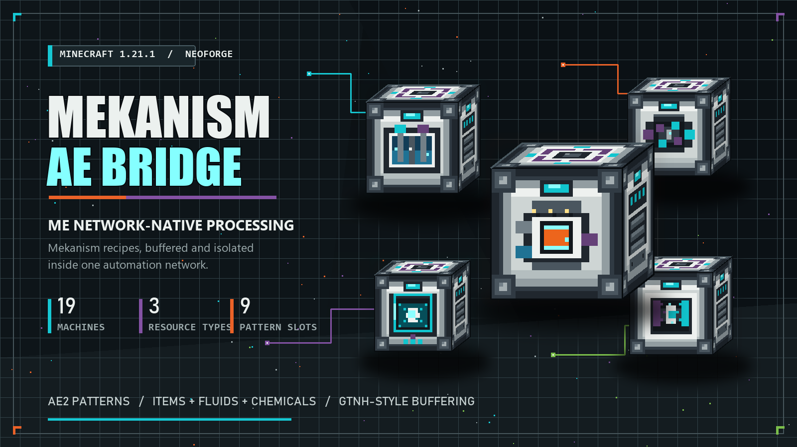

# Mekanism ME Integration



一个面向 Minecraft NeoForge 1.21.1 的开发中模组，目标是让 Mekanism 加工机器直接作为 AE2 处理样板提供器工作，并逐步实现类似 GTNH 样板总成的任务缓存与调度体验。

发布页文案：[中文简介](docs/project-description.zh-CN.md) · [English description](docs/project-description.en.md)

> 当前版本为 `v0.2.1`。核心玩法已经可用，但存档格式、GUI 和加工调度仍可能继续调整，升级前请备份重要存档。

## 当前实现

- ME 富集仓、ME 粉碎机、ME 通电冶炼炉、ME 冶金灌注机、ME 锇压缩机、ME 净化仓、ME 化学压射仓、ME 合并机、ME 精密锯木机、ME 化学氧化机、ME 化学结晶器、ME 反质子核合成机、ME 化学溶解室、ME 化学灌注器、ME 电解分离器、ME 回旋式气液转换机、ME 化学清洗机、ME 营养液化器与 ME 加压反应室，可被 AE2 网络识别为处理样板提供器。
- 顶部 9 个编码处理样板槽。
- NeoForge FE 与 Mekanism Strict Energy 双接口供能。
- ME 加速卡、并行卡和能量卡，每种最多安装 8 张。
- 左上角独立等级槽支持 Mekanism 原版四种等级安装器；等级提升最终并行、能量容量、输入速率与任务缓存，且不占用 ME 升级卡槽。
- 当前配方持续加工，等待任务按编码样板身份隔离。
- GTNH 风格的大容量预投递缓存；并行卡仅控制加工倍率，不限制 AE2 发配深度。
- 当前输入、预计产物、网络状态、队列、进度和能量 GUI。
- 暂停新任务以及将内部缓存资源返还至 ME 网络的按钮。
- 方块实体状态、能量、升级、样板和等待任务的 NBT 持久化。
- 十九台 ME 机器统一使用真正的 32×32 六面机架贴图；AE 在线时点亮接口，能够实际加工时播放各自的正面动画。
- 冶金灌注任务把物品与 Applied Mekanistics 化学品存入同一样板专属账本，不同灌注类型不会串料。
- 四种“物品 + 化学品 → 物品”机器共用样板专属账本；各机器只向 AE2 声明属于自己 Mekanism 配方类型的样板。
- `perTickUsage` 化学配方固定使用 JEI 展示的原版基础总耗量；加速卡和自定义加工时间不会改变每次加工的锇、氧气或氯气消耗。
- ME 化学氧化机支持“物品 → 化学品”，ME 化学结晶器支持“化学品 → 物品”；输入、输出和等待任务都使用 AE2 原生资源键记账，并按编码样板隔离。
- ME 反质子核合成机和 ME 化学溶解室支持“物品 + 化学品 → 物品/化学品”，ME 化学灌注器支持“两种化学品 → 化学品”；两路输入都保存在同一样板专属账本，化学灌注配方允许左右输入互换。
- 可变资源账本支持 1～3 路物品/流体/化学品输入和最多 2 路产物；电解、营养液化与加压反应配方即使不在样板中声明副产物，实际副产物也会独立返回 ME，且不会与其他样板串料。
- 连续低体积机器具有独立的每周期基础处理份数；化学灌注、电解、气液回旋和化学清洗统一默认 1,000 份，再与等级及并行卡倍率相乘，避免 1 mB 级配方吞吐失真。
- Jade 悬浮信息显示在线状态、缓冲操作、当前任务、化学品、实际速度/并行倍率和精确能量。
- 十九台 ME 机器注册为 Mekanism 现有 JEI 配方分类的加工设备；气液回旋机同时注册冷凝与气化两个方向，可直接查看各自能处理的配方。
- 十九台 ME 机器均可由对应的 Mekanism 普通机器与 AE2 样板供应器无序合成。
- 开发环境提供 JEI 与 AE2 JEI Integration，可从 JEI 的 `+` 按钮直接填充 AE2 处理样板。
- GuideME 提供中英文游戏内指南；每台机器 GUI 右上角的 AE2 问号按钮都可以直接打开。
- 双层平衡配置：整合包作者可设置全局默认值，每个存档也可选择启用自己的覆盖值。

## 安装与前置

本模组只支持 Minecraft `1.21.1`、NeoForge 和 Java 21。以下模组是强制前置，客户端和服务端都必须安装：

| 强制前置 | 最低版本 | 说明 |
| --- | --- | --- |
| NeoForge | `21.1.248` | 模组加载器 |
| Mekanism | `10.7.19` | 机器、配方与能量接口；不要求 Generators、Tools 或 Additions |
| Applied Energistics 2 | `19.2.17` | ME 网络与处理样板 |
| Applied Mekanistics | `1.6.3` | 让 AE2 网络能够存储和传输 Mekanism 化学品 |
| GuideME | `21.1.17` | 当前 AE2 版本的强制前置 |

以下模组不是启动必需，但建议安装：

| 可选模组 | 建议版本 | 用途 |
| --- | --- | --- |
| JEI | `19.27.0.335` | 查看机器配方和用途 |
| AE2 JEI Integration | `1.2.1` | 从 JEI 的 `+` 按钮填写 AE2 处理样板 |
| Jade | `15.10.5` | 查看网络、缓存、资源、并行和能量状态 |

最低版本是模组元数据允许的范围；发布包实际验证使用的是下方开发环境表中的完整版本组合。

## 计划方向

- 在通用 AE 资源账本基础上继续增加 Mekanism 加工机，并覆盖流体、多输入和特殊处理流程。
- 继续完善资源返还、方块拆除保护和异常恢复。

更完整的开发记录见 [PLAN.zh-CN.md](PLAN.zh-CN.md)。

## 开发环境

| 组件 | 版本 |
| --- | --- |
| Minecraft | `1.21.1` |
| NeoForge | `21.1.248` |
| Java | `21` |
| Mekanism | `10.7.19.85` |
| Applied Energistics 2 | `19.2.17` |
| Applied Mekanistics | `1.6.3` |
| GuideME | `21.1.17` |
| Just Enough Items | `19.27.0.335` |
| AE2 JEI Integration | `1.2.1` |
| Jade | `15.10.5` |

第三方模组 JAR 不提交到仓库。请按 [兼容性清单](docs/compatibility.md) 下载对应版本，并放入本地 `libs/` 目录。

```powershell
.\gradlew.bat build
.\gradlew.bat runClient
.\gradlew.bat runGameTestServer --no-configuration-cache
```

离线构建可使用：

```powershell
.\gradlew.bat build --offline
```

## 配置

在模组列表中选择 Mekanism ME Integration 并点击“配置”，或直接编辑以下文件：

- 全局默认：`config/mekanismae-server.toml`。
- 每存档覆盖：把全局文件复制到 `saves/<存档>/serverconfig/mekanismae-server.toml`，再修改该副本。NeoForge 只在同名副本存在时启用该存档的覆盖值。

可调整是否消耗 AE2 频道、待机 AE 功耗、红石暂停、能量容量与输入速率、每次加工耗能、基础加工时间、最大预投递缓存、每台机器独立的每周期基础处理份数、0～8 张加速卡/并行卡的完整倍率曲线，以及基础/高级/精英/终极安装器对并行、能量容量、输入速率和任务缓存的四组倍率。十九台机器默认继承统一的 `machines.defaults`；把对应机器的 `use_defaults` 改为 `false` 后，可以单独设置其能量、耗能、加工时间和缓存上限。`base_operations_per_cycle` 始终按机器单独设置，不受 `use_defaults` 影响。

这些参数都在世界重新载入时应用。没有存档副本时，所有存档直接沿用全局文件；这也是默认状态。默认等级并行倍率为 `3/6/10/16`，其余三组等级倍率为 `2/4/8/16`；最终并行是等级倍率与并行卡倍率的乘积。降低缓存上限或移除等级安装器不会删除已接收任务，但机器在低于新上限前不会再接收新任务；降低能量容量时，超出新容量的已存能量会被截断。

## 参与开发

欢迎通过 Issue 讨论设计，或从新分支提交 Pull Request。本项目使用 [MIT License](LICENSE)；提交贡献即表示你同意按 MIT License 授权该贡献。
